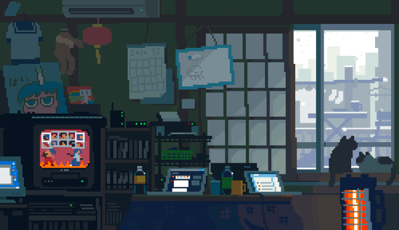

---------------------------------------------------------------------------

 

### Olá, meu nome é Diego Vitali!

Estudante de ADS do IFSP!  Eu sou desenvolvedor Back-End em Aprendizado!

 
 

 - > CONTATO < -

  <a align='center' href="https://api.whatsapp.com/send?phone=5511940779440&text=Ol%C3%A1!">
  <a align='center' href="https://www.linkedin.com/in/diego-vitali-625619288">
  

     

 - > LINGUAGENS < -

  
  
  
  
  
  
  
  

